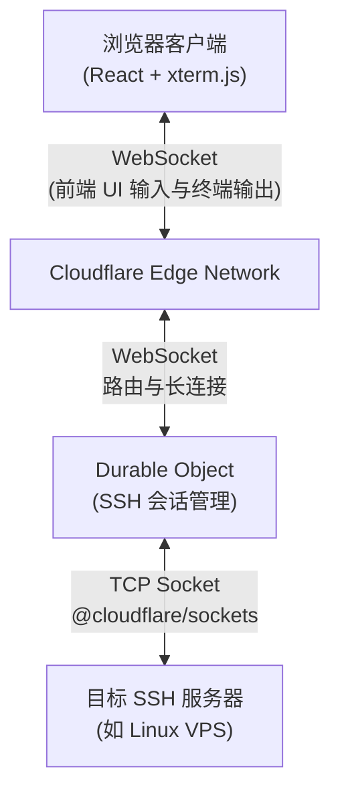

<div align="center">
  <h1>CloudSSH</h1>
  <p>一个基于 Cloudflare Workers 的 Serverless Web SSH 终端：通过浏览器直接连接和管理你的服务器。</p>
  <p><b>极致轻量 · 开箱即用 · 赛博朋克 UI</b></p>
  <p>
    <a href="https://github.com/newbietan/CloudSSH/stargazers"></a>
    <a href="LICENSE"></a>
    
    
    
  </p>
  <p>
    <a href="#highlights">核心优势</a> ·
    <a href="#features">功能特性</a> ·
    <a href="#quick-start">部署指南</a> ·
    <a href="#architecture">架构设计</a> ·
    <a href="#license">开源协议</a>
  </p>
  <p>
    <a href="README.md">简体中文</a> |
    <a href="README_en.md">English</a>
  </p>
</div>

> [!TIP]
> **CloudSSH** 利用 Cloudflare Workers 的 TCP Sockets 支持，在边缘节点实现 SSH 协议的解析与转发，提供低延迟的 Web 终端体验。

## 效果演示

> 想象一下，随时随地打开浏览器，就能以极具科技感的赛博朋克 UI 连接你的服务器，无需安装任何 SSH 客户端。

## 目录

- [核心优势](#highlights)
- [核心特性](#features)
- [架构说明](#architecture)
- [快速部署](#quick-start)
- [开发说明](#development)
- [开源协议](#license)

<a id="highlights"></a>
## 核心优势

### 极致 Serverless

- **零服务器成本**：纯前端部署 + Cloudflare Workers，无需自建后端服务器。
- **边缘加速**：得益于 Cloudflare 的全球边缘网络，随时随地享受低延迟的 SSH 连接。

### 开箱即用

- **一键部署**：通过 Wrangler 工具，一句命令即可完成项目构建与部署。
- **现代化前端技术栈**：React + TypeScript + Vite + Tailwind CSS，配合 xterm.js 提供丝滑的终端体验。

### 安全可靠

- **端到端加密**：完整的 SSH-2.0 协议实现，包括 ECDH 密钥交换、Ed25519 签名认证以及 AES-256-GCM 数据加密。
- **隔离的会话状态**：借助 Cloudflare Durable Objects 和 Hibernation API，每个终端会话都在沙盒内安全、持久地运行。

<a id="features"></a>
## 核心特性

- **完整的 SSH 握手**：原生 TypeScript 实现 SSH 传输层协议与用户认证协议。
- **密码认证**：支持标准 SSH 密码认证。
- **全功能终端**：基于 `xterm.js`，支持颜色输出、自适应窗口大小调整 (Window Adjust)。
- **持久化连接**：基于 Durable Objects 的 WebSocket Hibernation API，保持长时间的 SSH 稳定连接，支持 Keepalive 心跳保活。
- **响应式界面**：美观的登录面板和状态栏，支持移动端访问。

<a id="architecture"></a>
## 架构说明



1. 用户在前端输入主机 IP、账号和密码。
2. 前端与后端的 Durable Object 建立 WebSocket 连接。
3. DO 接收凭据，使用 `@cloudflare/sockets` 与目标 SSH 服务器建立 TCP 连接。
4. DO 纯代码实现 SSH 协议协商（密钥交换、密码认证等），并将加密后的终端数据通过 WebSocket 转发给前端。

<a id="quick-start"></a>
## 快速部署

### 前置要求

- 一个 Cloudflare 账号。
- Node.js 环境 (v18+)。
- 启用 Cloudflare Workers 付费计划（TCP Sockets 和 Durable Objects 功能需要）。

### 部署步骤

1. **克隆仓库**
   ```bash
   git clone https://github.com/newbietan/CloudSSH.git
   cd CloudSSH
   ```

2. **安装依赖**
   ```bash
   npm install
   ```

3. **登录 Cloudflare**
   ```bash
   npx wrangler login
   ```

4. **一键部署**
   ```bash
   npm run deploy
   ```

部署完成后，Wrangler 会输出你的 Worker URL。打开浏览器访问该 URL，即可开始使用你的 Web SSH 终端。

<a id="development"></a>
## 开发说明

本项目分为两部分：
1. **Frontend (前端)**：在 `frontend/` 目录下，使用 Vite 构建。
2. **Worker (后端)**：在 `src/` 目录下，包含 Cloudflare Worker 入口与 SSH 协议的核心实现。

在本地开发时，可以运行：
```bash
npm run dev
```
此命令将启动 Wrangler 的本地开发环境服务器。

<a id="license"></a>
## 开源协议

本项目基于 [MIT License](LICENSE) 协议开源。欢迎提交 Issue 和 Pull Request 共建社区。
