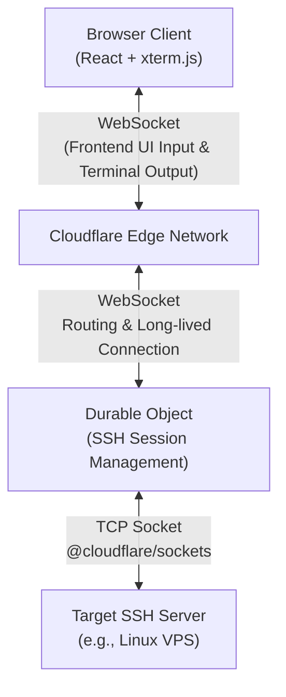

<div align="center">
  <h1>CloudSSH</h1>
  <p>A Serverless Web SSH Terminal built on Cloudflare Workers: Connect and manage your servers directly from the browser.</p>
  <p><b>Ultra-lightweight · Out-of-the-box · Cyberpunk UI</b></p>
  <p>
    <a href="https://github.com/newbietan/CloudSSH/stargazers"></a>
    <a href="LICENSE"></a>
    
    
    
  </p>
  <p>
    <a href="#highlights">Highlights</a> ·
    <a href="#features">Features</a> ·
    <a href="#quick-start">Deployment</a> ·
    <a href="#architecture">Architecture</a> ·
    <a href="#license">License</a>
  </p>
  <p>
    <a href="README.md">简体中文</a> |
    <a href="README_en.md">English</a>
  </p>
</div>

> [!TIP]
> **CloudSSH** utilizes Cloudflare Workers' TCP Sockets support to handle SSH protocol parsing and forwarding at edge nodes, providing a low-latency Web Terminal experience.

## Demo

> Imagine opening your browser anytime, anywhere, and connecting to your server with a highly futuristic cyberpunk UI, without installing any SSH client.

## Table of Contents

- [Highlights](#highlights)
- [Features](#features)
- [Architecture](#architecture)
- [Quick Deployment](#quick-start)
- [Development](#development)
- [License](#license)

<a id="highlights"></a>
## Highlights

### Ultimate Serverless

- **Zero Server Cost**: Pure frontend deployment + Cloudflare Workers, no need to build your own backend servers.
- **Edge Acceleration**: Benefit from Cloudflare's global edge network, enjoying low-latency SSH connections from anywhere.

### Out of the Box

- **One-Click Deployment**: Build and deploy the project with a single command using the Wrangler CLI.
- **Modern Frontend Stack**: React + TypeScript + Vite + Tailwind CSS, paired with xterm.js to provide a silky smooth terminal experience.

### Secure and Reliable

- **End-to-End Encryption**: Complete implementation of the SSH-2.0 protocol, including ECDH key exchange, Ed25519 signature authentication, and AES-256-GCM data encryption.
- **Isolated Session State**: Leveraging Cloudflare Durable Objects and the Hibernation API, every terminal session runs securely and persistently within its sandbox.

<a id="features"></a>
## Features

- **Full SSH Handshake**: Native TypeScript implementation of the SSH transport layer and user authentication protocols.
- **Password Authentication**: Supports standard SSH password authentication.
- **Full-Featured Terminal**: Based on `xterm.js`, supporting color output and adaptive window resizing (Window Adjust).
- **Persistent Connections**: Built on the Durable Objects WebSocket Hibernation API, maintaining long-lived stable SSH connections with Keepalive support.
- **Responsive UI**: Beautiful login panel and status bar, fully compatible with mobile access.

<a id="architecture"></a>
## Architecture



1. The user enters the host IP, username, and password on the frontend.
2. The frontend establishes a WebSocket connection with the backend Durable Object.
3. The DO receives the credentials and establishes a TCP connection with the target SSH server using `@cloudflare/sockets`.
4. The DO handles the entire SSH protocol negotiation (key exchange, password auth, etc.) in pure code and forwards the encrypted terminal data to the frontend via WebSocket.

<a id="quick-start"></a>
## Quick Deployment

### Prerequisites

- A Cloudflare account.
- Node.js environment (v18+).
- Cloudflare Workers Paid Plan enabled (required for TCP Sockets and Durable Objects features).

### Steps

1. **Clone the Repository**
   ```bash
   git clone https://github.com/newbietan/CloudSSH.git
   cd CloudSSH
   ```

2. **Install Dependencies**
   ```bash
   npm install
   ```

3. **Login to Cloudflare**
   ```bash
   npx wrangler login
   ```

4. **One-Click Deploy**
   ```bash
   npm run deploy
   ```

Once deployed, Wrangler will output your Worker URL. Open that URL in your browser to start using your Web SSH terminal.

<a id="development"></a>
## Development

This project consists of two parts:
1. **Frontend**: Located in the `frontend/` directory, built with Vite.
2. **Worker**: Located in the `src/` directory, containing the Cloudflare Worker entry point and the core SSH protocol implementation.

For local development, you can run:
```bash
npm run dev
```
This command starts Wrangler's local development environment server.

<a id="license"></a>
## License

This project is open-sourced under the [MIT License](LICENSE). Issues and Pull Requests are welcome to help build the community.
